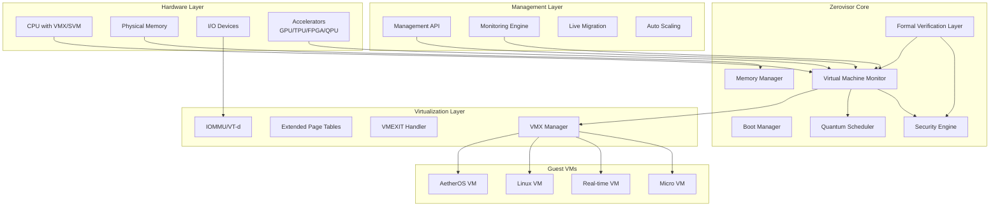

# Zerovisor ハイパーバイザー設計書

## 概要

Zerovisorは、世界最高峰の性能、セキュリティ、信頼性を実現するRust製Type-1ハイパーバイザーです。本設計書では、15の革新的要件を満たすための包括的なアーキテクチャと実装戦略を定義します。

## アーキテクチャ

### 全体アーキテクチャ



### レイヤード設計

#### Layer 0: ハードウェア抽象化層 (HAL)
- **目的**: 複数アーキテクチャ（x86_64, ARM64, RISC-V）の統一インターフェース
- **コンポーネント**:
  - CPU抽象化（VMX/SVM/ARMv8-A/RISC-V H-ext）
  - メモリ管理ユニット抽象化
  - 割り込みコントローラー抽象化
  - タイマー抽象化

#### Layer 1: マイクロカーネル
- **目的**: 最小限の特権コードでセキュリティと信頼性を最大化
- **コンポーネント**:
  - プロセス管理
  - メモリ管理
  - IPC（Inter-Process Communication）
  - 例外・割り込み処理

#### Layer 2: 仮想化エンジン
- **目的**: 高性能な仮想マシン実行環境
- **コンポーネント**:
  - VMCS管理
  - EPT/NPT管理
  - VMEXIT処理
  - デバイス仮想化

#### Layer 3: 管理・制御層
- **目的**: VM管理、監視、最適化
- **コンポーネント**:
  - VM生成・削除
  - リソース管理
  - パフォーマンス監視
  - セキュリティ監査

## コンポーネントとインターフェース

### 1. ブートマネージャー

```rust
pub struct BootManager {
    memory_map: PhysicalMemoryMap,
    cpu_features: CpuFeatures,
    security_state: SecurityState,
}

impl BootManager {
    pub fn initialize() -> Result<Self, BootError>;
    pub fn setup_vmx() -> Result<(), VmxError>;
    pub fn verify_hardware_requirements() -> Result<(), HardwareError>;
    pub fn establish_root_of_trust() -> Result<(), SecurityError>;
}
```

### 2. VMXマネージャー

```rust
pub struct VmxManager {
    vmxon_region: PhysicalAddress,
    vmcs_pool: VmcsPool,
    ept_manager: EptManager,
}

impl VmxManager {
    pub fn enable_vmx() -> Result<(), VmxError>;
    pub fn create_vmcs() -> Result<VmcsHandle, VmcsError>;
    pub fn launch_vm(&self, config: VmConfig) -> Result<VmHandle, VmError>;
    pub fn handle_vmexit(&self, exit_info: VmexitInfo) -> VmexitAction;
}
```

### 3. 量子スケジューラー

```rust
pub struct QuantumScheduler {
    ready_queue: PriorityQueue<VmHandle>,
    real_time_queue: RealTimeQueue<VmHandle>,
    quantum_state: QuantumState,
}

impl QuantumScheduler {
    pub fn schedule_next() -> Option<VmHandle>;
    pub fn add_vm(&mut self, vm: VmHandle, priority: Priority);
    pub fn handle_quantum_expiry(&mut self);
    pub fn guarantee_real_time_constraints(&self) -> Result<(), RtError>;
}
```

### 4. メモリマネージャー

```rust
pub struct MemoryManager {
    physical_allocator: PhysicalAllocator,
    ept_tables: HashMap<VmId, EptTable>,
    memory_encryption: MemoryEncryption,
}

impl MemoryManager {
    pub fn allocate_guest_memory(&mut self, size: usize) -> Result<GuestMemory, MemError>;
    pub fn setup_ept(&mut self, vm_id: VmId) -> Result<(), EptError>;
    pub fn encrypt_memory(&self, addr: PhysicalAddress) -> Result<(), CryptoError>;
    pub fn verify_memory_integrity(&self) -> Result<(), IntegrityError>;
}
```

### 5. セキュリティエンジン

```rust
pub struct SecurityEngine {
    quantum_crypto: QuantumCrypto,
    attestation: RemoteAttestation,
    isolation_engine: IsolationEngine,
}

impl SecurityEngine {
    pub fn initialize_quantum_crypto() -> Result<(), CryptoError>;
    pub fn perform_attestation(&self) -> Result<AttestationReport, AttestationError>;
    pub fn enforce_isolation(&self, vm_id: VmId) -> Result<(), IsolationError>;
    pub fn audit_security_events(&self) -> SecurityAuditLog;
}
```

## データモデル

### VM構成データ

```rust
#[derive(Debug, Clone, Serialize, Deserialize)]
pub struct VmConfig {
    pub id: VmId,
    pub name: String,
    pub cpu_count: u32,
    pub memory_size: u64,
    pub vm_type: VmType,
    pub security_level: SecurityLevel,
    pub real_time_constraints: Option<RealTimeConstraints>,
    pub accelerators: Vec<AcceleratorConfig>,
}

#[derive(Debug, Clone)]
pub enum VmType {
    Standard,
    MicroVm,
    RealTime,
    Quantum,
    Container,
}

#[derive(Debug, Clone)]
pub struct RealTimeConstraints {
    pub max_latency: Duration,
    pub wcet: Duration,
    pub priority: RealTimePriority,
}
```

### VMCS構造体

```rust
#[repr(C, align(4096))]
pub struct Vmcs {
    pub revision_id: u32,
    pub abort_indicator: u32,
    pub guest_state: GuestState,
    pub host_state: HostState,
    pub execution_controls: ExecutionControls,
    pub exit_controls: ExitControls,
    pub entry_controls: EntryControls,
}

#[derive(Debug, Clone)]
pub struct GuestState {
    pub rip: u64,
    pub rsp: u64,
    pub rflags: u64,
    pub cr0: u64,
    pub cr3: u64,
    pub cr4: u64,
    pub segment_registers: SegmentRegisters,
}
```

### EPTエントリ

```rust
#[derive(Debug, Clone, Copy)]
pub struct EptEntry {
    pub present: bool,
    pub writable: bool,
    pub executable: bool,
    pub memory_type: MemoryType,
    pub physical_address: PhysicalAddress,
    pub accessed: bool,
    pub dirty: bool,
}
```

## エラーハンドリング

### エラー階層

```rust
#[derive(Debug, Error)]
pub enum ZerovisorError {
    #[error("Hardware error: {0}")]
    Hardware(#[from] HardwareError),
    
    #[error("VMX error: {0}")]
    Vmx(#[from] VmxError),
    
    #[error("Memory error: {0}")]
    Memory(#[from] MemoryError),
    
    #[error("Security error: {0}")]
    Security(#[from] SecurityError),
    
    #[error("Real-time constraint violation: {0}")]
    RealTime(#[from] RealTimeError),
}
```

### パニック処理

```rust
#[panic_handler]
fn panic_handler(info: &PanicInfo) -> ! {
    // 1. セキュアな状態でシステムを停止
    disable_interrupts();
    
    // 2. パニック情報をセキュアログに記録
    secure_log_panic(info);
    
    // 3. 実行中のVMを安全に停止
    emergency_vm_shutdown();
    
    // 4. ハードウェアリセット
    hardware_reset();
}
```

## テスト戦略

### 1. 単体テスト

```rust
#[cfg(test)]
mod tests {
    use super::*;
    
    #[test]
    fn test_vmx_initialization() {
        let vmx_manager = VmxManager::new();
        assert!(vmx_manager.enable_vmx().is_ok());
    }
    
    #[test]
    fn test_memory_allocation() {
        let mut mem_manager = MemoryManager::new();
        let guest_mem = mem_manager.allocate_guest_memory(1024 * 1024);
        assert!(guest_mem.is_ok());
    }
}
```

### 2. 統合テスト

```rust
#[cfg(test)]
mod integration_tests {
    #[test]
    fn test_vm_lifecycle() {
        // VM作成 -> 起動 -> 実行 -> 停止 -> 削除
        let vm_config = VmConfig::default();
        let vm = create_vm(vm_config).unwrap();
        start_vm(vm.id()).unwrap();
        
        // ゲストコード実行テスト
        execute_guest_code(&vm, test_payload()).unwrap();
        
        stop_vm(vm.id()).unwrap();
        destroy_vm(vm.id()).unwrap();
    }
}
```

### 3. 形式検証テスト

```rust
// TLA+仕様との整合性検証
#[cfg(feature = "formal_verification")]
mod formal_tests {
    use tla_plus_checker::*;
    
    #[test]
    fn verify_memory_safety() {
        let spec = load_tla_spec("memory_safety.tla");
        let implementation = extract_implementation();
        assert!(verify_refinement(spec, implementation));
    }
}
```

### 4. パフォーマンステスト

```rust
#[cfg(test)]
mod performance_tests {
    #[test]
    fn benchmark_vmexit_latency() {
        let start = rdtsc();
        trigger_vmexit();
        let end = rdtsc();
        
        let latency_ns = cycles_to_nanoseconds(end - start);
        assert!(latency_ns < 10); // 10ナノ秒以下
    }
    
    #[test]
    fn benchmark_vm_startup_time() {
        let start = Instant::now();
        let vm = create_and_start_micro_vm().unwrap();
        let duration = start.elapsed();
        
        assert!(duration < Duration::from_millis(50)); // 50ms以下
    }
}
```

## セキュリティ設計

### 1. 量子耐性暗号

```rust
pub struct QuantumCrypto {
    kyber_keypair: KyberKeypair,
    dilithium_keypair: DilithiumKeypair,
    sphincs_keypair: SphincsKeypair,
}

impl QuantumCrypto {
    pub fn generate_keypairs() -> Result<Self, CryptoError>;
    pub fn encrypt_memory(&self, data: &[u8]) -> Result<Vec<u8>, CryptoError>;
    pub fn sign_attestation(&self, report: &[u8]) -> Result<Signature, CryptoError>;
}
```

### 2. 形式検証統合

```rust
// Coq証明との連携
#[cfg(feature = "coq_proofs")]
pub mod formal_proofs {
    extern "C" {
        fn verify_memory_safety_proof() -> bool;
        fn verify_isolation_proof() -> bool;
        fn verify_real_time_proof() -> bool;
    }
    
    pub fn verify_all_proofs() -> Result<(), ProofError> {
        if !unsafe { verify_memory_safety_proof() } {
            return Err(ProofError::MemorySafety);
        }
        if !unsafe { verify_isolation_proof() } {
            return Err(ProofError::Isolation);
        }
        if !unsafe { verify_real_time_proof() } {
            return Err(ProofError::RealTime);
        }
        Ok(())
    }
}
```

## パフォーマンス最適化

### 1. ゼロコピー最適化

```rust
pub struct ZeroCopyBuffer {
    physical_addr: PhysicalAddress,
    virtual_addr: VirtualAddress,
    size: usize,
}

impl ZeroCopyBuffer {
    pub fn share_with_guest(&self, vm_id: VmId) -> Result<(), ShareError>;
    pub fn direct_dma_access(&self) -> Result<DmaHandle, DmaError>;
}
```

### 2. NUMA最適化

```rust
pub struct NumaOptimizer {
    topology: NumaTopology,
    affinity_map: HashMap<VmId, NumaNode>,
}

impl NumaOptimizer {
    pub fn optimize_vm_placement(&self, vm_config: &VmConfig) -> NumaNode;
    pub fn migrate_vm_memory(&self, vm_id: VmId, target_node: NumaNode) -> Result<(), MigrationError>;
}
```

## 監視とデバッグ

### 1. リアルタイム監視

```rust
pub struct MonitoringEngine {
    metrics_collector: MetricsCollector,
    alert_manager: AlertManager,
    trace_buffer: TraceBuffer,
}

impl MonitoringEngine {
    pub fn collect_performance_metrics(&self) -> PerformanceMetrics;
    pub fn detect_anomalies(&self) -> Vec<Anomaly>;
    pub fn generate_security_report(&self) -> SecurityReport;
}
```

### 2. デバッグインターフェース

```rust
pub struct DebugInterface {
    gdb_stub: GdbStub,
    trace_points: Vec<TracePoint>,
    breakpoints: Vec<Breakpoint>,
}

impl DebugInterface {
    pub fn attach_debugger(&mut self, vm_id: VmId) -> Result<(), DebugError>;
    pub fn set_breakpoint(&mut self, addr: VirtualAddress) -> Result<(), DebugError>;
    pub fn single_step(&self, vm_id: VmId) -> Result<(), DebugError>;
}
```

## 拡張性とモジュール性

### 1. プラグインアーキテクチャ

```rust
pub trait HypervisorPlugin {
    fn initialize(&self) -> Result<(), PluginError>;
    fn handle_vmexit(&self, exit_info: &VmexitInfo) -> Option<VmexitAction>;
    fn cleanup(&self) -> Result<(), PluginError>;
}

pub struct PluginManager {
    plugins: Vec<Box<dyn HypervisorPlugin>>,
}
```

### 2. 動的機能拡張

```rust
pub struct FeatureRegistry {
    features: HashMap<String, Box<dyn Feature>>,
}

impl FeatureRegistry {
    pub fn register_feature(&mut self, name: String, feature: Box<dyn Feature>);
    pub fn enable_feature(&self, name: &str) -> Result<(), FeatureError>;
    pub fn disable_feature(&self, name: &str) -> Result<(), FeatureError>;
}
```

この設計書は、世界最高峰のハイパーバイザーを実現するための包括的な技術仕様を提供します。各コンポーネントは高度に最適化され、形式検証により正しさが保証され、量子耐性セキュリティにより将来の脅威からも保護されます。