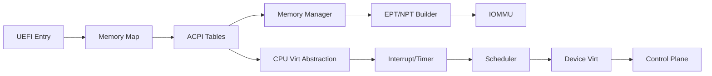
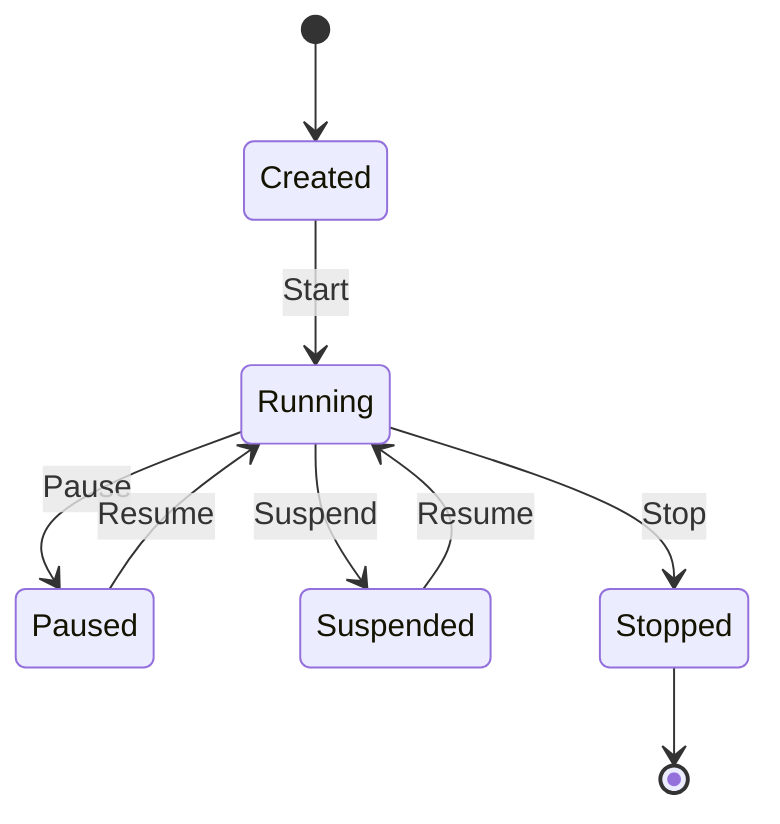

### Zerovisor 設計書（design.md）

### 高レベルアーキテクチャ
- ブート層（UEFI/no_std）
  - UEFIエントリで初期化、ACPIテーブル入手、メモリマップ取得、SMPブリングアップ前準備。
- ハイパーバイザーコア
  - CPU仮想化抽象層（Intel VMX/EPT、AMD SVM/NPT）
  - メモリ管理（二段ページング、NUMA/ヒュージページ、割当/解放、ガベージレス設計）
  - 割り込み/タイマ（APICv/Posted Interrupts/VT‑x最適化、SVM側最適化、HPET/TSC）
  - デバイス仮想化（VirtIO、vPCI、vIOMMU、パススルー管理）
  - スケジューラ（公平/重み付き/RT）
  - セキュリティ（最小権限、W^X、SMEP/SMAP支援、測定ブート連携）
- 管理プレーン
  - Out‑of‑band/Separate‑Core/Separate‑Hostのいずれかを構成可能。
  - API（gRPC/REST over IP、将来）とCLI、ログ/メトリクス/トレース。

### 技術スタック選定（C/C++非依存）
- 言語: Rust（stable, no_std）
- ブート: UEFI（`x86_64-unknown-uefi`、`uefi`クレート）
- 低水準: `core`, `alloc`, `compiler_builtins`, `core::arch::asm!`
- メモリ/構造: `x86_64`（型安全な記述を参考にしつつ、依存は慎重に）
- i18n: 簡易辞書ベース（JSON/静的マップ）を自作（外部C依存なし）

### 代替技術（C/C++禁止対応）
- ACPI: 公式仕様に沿った純Rustパーサを自前実装（段階的対応）。
- IOMMU: VT‑d/AMD‑VI仕様に基づく純Rustテーブル生成とプログラミング。
- VirtIO: 規格準拠の純Rustドライバを段階的拡充。

### 主要コンポーネント詳細
- vmx_svm_abstraction
  - 責務: CPU仮想化共通IFを提供。ベンダ別バックエンド（vmx、svm）を切替。
  - API（例）
    - `detect_capabilities() -> Capabilities`
    - `enter_guest(vcpu)` / `exit_reason()` / `advance_rip()`
- memory_manager
  - 責務: 物理/仮想アドレス空間の確保、EPT/NPT構築、ヒュージページ最適化。
  - API（例）
    - `alloc_guest_pa(size, numa_pref)` / `map_guest(gpa -> hpa, attrs)`
- device_virtualization
  - 責務: VirtIO、vPCI、SR‑IOV、DMAリマップ、割込ルーティング。
- scheduler
  - 責務: vCPU時間配分（公平/重み付き/RT）。
- security
  - 責務: 境界防御、W^X、ページ初期化、ランタイム自己検証。

### データモデル（概要）
- `VM { id, vcpus: Vec<Vcpu>, mem_regions: Vec<Region>, devices: Vec<VirtDev>, policy: SecurityPolicy }`
- `Vcpu { id, arch: VcpuArchState, run_state, timers }`
- `Capabilities { vmx: Option<VmxCaps>, svm: Option<SvmCaps>, ept: bool, npt: bool, vtd: bool, amdv_iommu: bool }`

### セキュリティ設計
- ブート: セキュアブート互換、測定ブート（TPMイベントログ）と連携。
- メモリ安全: Rust、W^X、SMEP/SMAP、KASLR相当の配置ランダマイズ。
- 表面最小化: 必要機能のみリンク、管理面は分離。
- 監査/鍵管理: 監査ログ、署名済みメタデータ、将来HSM連携。

### エラーハンドリング
- 失敗は明確なエラー型で伝播。致命的エラーはフォールトスクリーンを出し停止。
- ログの多言語化（最小: 日本語/英語）。

### デプロイ/ブート
- UEFIアプリとして起動し、初期段階ではUEFIコンソールへ状態出力。
- ACPI解釈後にSMP初期化、VMX/SVM有効化、IOMMU検出/初期化へ進む。

### 参考仕様
- Intel SDM、AMD APM、UEFI、ACPI、VT‑d、AMD‑VI（requirements.md参照）

### 付録: 詳細設計強化（Architecture Deep Dive）

#### スコープと最上位目標（Scope & Top Goals）
- 対象: x86‑64、UEFIブート、SMP。管理プレーンは別ホスト/別コア/別VMの構成を許容。
- 目標: 極小VM‑Entry/Exitオーバーヘッド、EPT/NPT高ヒット率、ゼロコピーI/O、強分離、国際化。

#### コンポーネント境界（Component Boundaries）
- CPU仮想化抽象: VMX/SVMの差異を吸収し、共通IF（enter/exit、VMCS/VMCB操作、MSR管理）を提供。
- メモリ管理: 物理/仮想アロケータ、NUMAプール、EPT/NPT構築（4K/2M/1G）、A/Dビット活用。
- 割り込み/タイマ: APICv Posted‑Interrupts/AVIC最適化、Invariant TSC基準、HPETフォールバック。
- I/O & デバイス: VirtIO、vPCI、MSI‑X、IOMMU（VT‑d/AMD‑VI）、SR‑IOVパススルー。
- 可観測性: 構造化ログ、メトリクス、トレース、監査、クラッシュダンプ。

#### 実行・同期モデル（Execution & Concurrency）
- 割り込み: APICv/Posted‑Interrupts と AVIC を検出し自動選択。IPI/EOIの最小化とバッチ化。
- タイマ: Invariant TSC を一次基準にし、HPETでキャリブレーション。TSCスケーリング/停止時挙動を考慮。
- 同期: ロック階層、読取最適化（RCU様）、割込みコンテキスト短縮、NUMAローカリティ維持。

#### メモリ（Memory Virtualization）
- 二段変換: EPT/NPT テーブルを段階的生成。4K/2M/1G混在、アクセス/Dirtyビットハンドリング、TLBシュートダウン最適化。
- 共有/重複排除: 同一ページ検出、コピーオンライト、安全なゼロ化、ページバルーン連携。
- NUMA: ノード別プール、割当方針、スケジューラとの協調でローカリティ維持。

#### IOMMUとデバイス（I/O & IOMMU）
- VT‑d/AMD‑VI: DMA/割込リマップ、隔離ドメイン、フェイルセーフ無効化ポリシ。
- 先進機能: ATS/PRI/PASID（対応HWで有効化）。vIOMMUの露出方針とセキュリティ境界を明記。
- SR‑IOV: VF割当、ACS/ARI、NUMAトポロジ意識の配置と帯域飽和時制御。

#### スケジューラ（Scheduler）
- ポリシ: CFS系フェア+重み、RTクラス（期限/固定）、プリエンプションと優先度継承。
- 目標: スイッチオーバーヘッド低減、キャッシュ/NUMAローカリティ最大化、レイテンシ上限の確定化。

#### セキュリティ（Security）
- メモリ安全とW^X/SMEP/SMAP。未初期化メモリの禁止、境界チェック強制。
- 測定ブート: UEFI Secure Boot互換、TPMイベントログ収集、コンフィグ測定と監査保存。
- 秘密管理: キーマテリアルの作用域最小化、使用後ゼロ化、ロギング除外。

#### 可観測性（Observability）
- ログ: 構造化（JSONライン等）、レベル/カテゴリ/言語タグ、永続化と回転。
- メトリクス: カウンタ/ゲージ/ヒストグラム。VM/vCPU/デバイス粒度。エクスポートIF（将来）。
- トレース: VM‑Entry/Exit、EPT更新、割込注入、IOMMUマップ変更の計測点。
- 監査: `src/diag/audit.rs` によるリングバッファで、VM生成/開始/停止/破棄、IOMMUドメイン作成、デバイス割当/解除を記録。CLI `audit`でダンプ。
- ウォッチドッグ: `src/diag/watchdog.rs` によりUEFI BootServicesの `set_watchdog_timer` を利用してアーム/解除。CLI `wdog [off|<seconds>]` で制御。
- クラッシュダンプ: 最小/完全の選択、署名、オフライン解析を前提（初期段階はパニック時バナー出力）。

#### 国際化（i18n）
- 辞書ベース（日/英/中）。欠落は英語フォールバック。CLI/ログは動的切替を許容。

#### 状態機械（VM/ハイパーバイザー）

#### パフォーマンス指標（KPI例）
- VM‑Entry/Exit の平均/分位サイクル数。
- EPT/NPTヒット率、TLBシュートダウン頻度、Posted‑Interrupts/AVIC適用比率。
- I/Oゼロコピー率、マルチキュー飽和時スループット/レイテンシ。

#### 追加参照（Authoritative Specs）
- Intel SDM / APICv / Invariant TSC: [Intel SDM](https://www.intel.com/content/www/us/en/developer/articles/technical/intel-sdm.html)
- AMD APM / AVIC / SVM: [AMD Tech Docs](https://www.amd.com/en/developer/tech-docs.html)
- UEFI / ACPI: [UEFI Specs](https://uefi.org/specifications)
- VT‑d: [Intel VT‑d Architecture Specification](https://www.intel.com/content/www/us/en/content-details/671488/intel-virtualization-technology-for-directed-i-o-architecture-specification.html)
- AMD‑VI: [AMD IOMMU Architecture Specification](https://www.amd.com/en/developer/tech-docs.html)

### ライブマイグレーション基盤（初期実装）

- ダーティページ追跡: EPT/NPTのA/Dフラグを用いた恒等マップ上の走査、クリア可。
- フレーミング: ヘッダ（魔法/seq/len/CRC32）+ ペイロード、RLE圧縮オプション、ゼロ/ハッシュ重複スキップ。
- Sink: Console/Null/Buffer/SNP(UEFI)/VirtIO-net(1.0+、いずれもfeature-gated)。
- 制御: ACK/NAK + resend、Txログに基づく再送ウィンドウ送出。
- 検証: CRC/順序検証、必要時の自動ACK/NAK送出。
- 可観測性: metrics/trace/auditへ一貫して出力（ラウンド数、バイト数、欠落/重複、帯域）。

### VirtIO-net (modern 1.0+) 簡易実装

- PCI Vendor Capからcommon/notifyを抽出し、BAR解決（64bit BAR対応）。
- TX(1)/RX(0)の各キューをUEFIページで確保、notify経路確立。
- RXポンプがMIGフレームを取り込み、CRC検証後にチャネルへ書き込み。
- 省略: 割込み/MSI、複数キュー、オフロード。初期段階ではポーリングで確認。